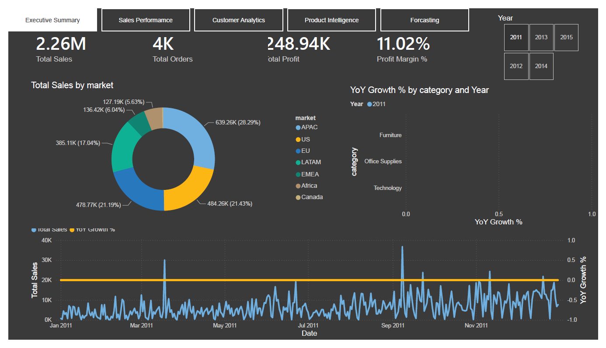
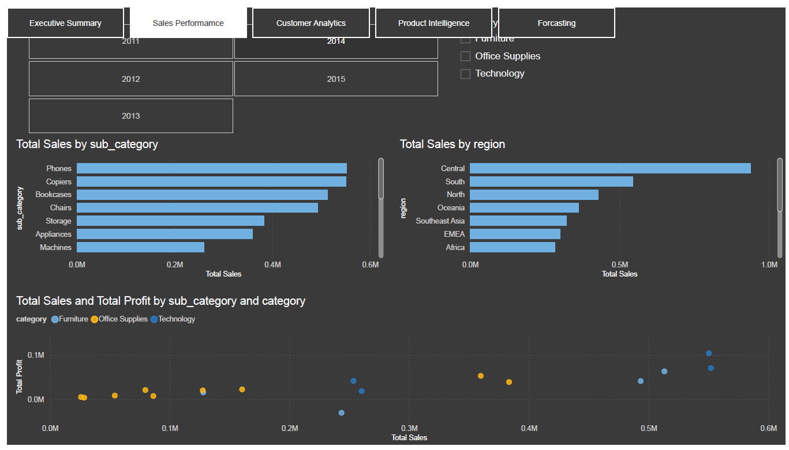
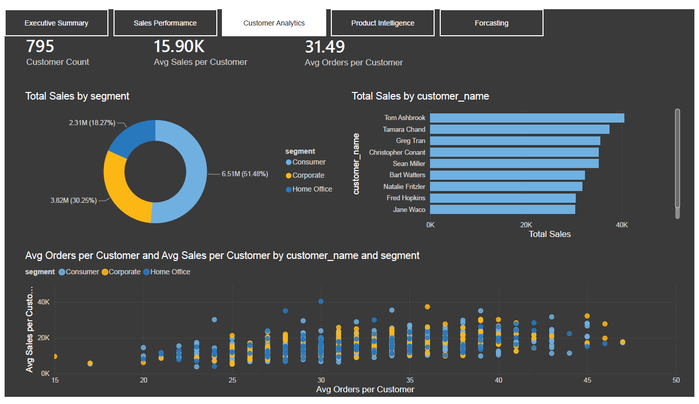
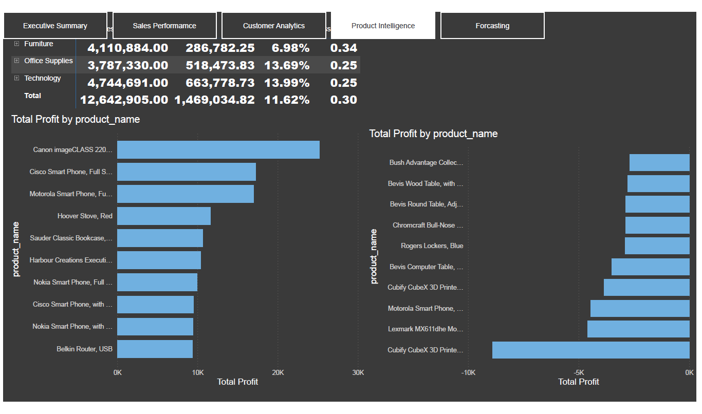
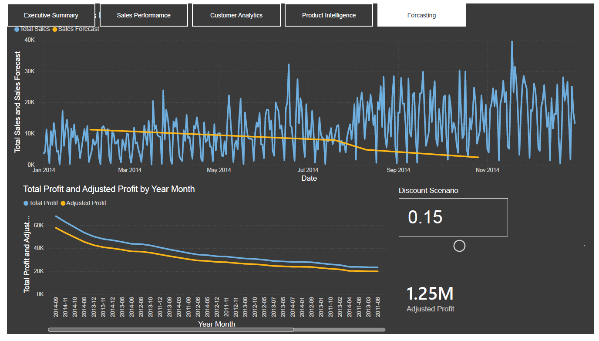

# SuperStore Sales Analytics — Power BI Dashboard

An end-to-end Power BI project built on the Global Superstore dataset, covering data modeling, advanced DAX, row-level security, and scenario forecasting. Built to demonstrate a full BI workflow: from raw CSV to a five-page interactive report.


-----

## 📊 Overview

This report analyzes ~51,000 global orders (2011–2014) across 7 markets, 3 product categories, and 795 customers. It’s built on a star schema data model with full Time Intelligence, Row-Level Security, a What-If scenario tool, and a custom DAX-based forecasting model.

-----

## 🗂️ Report Pages

### Executive Summary

High-level KPIs, sales trend, YoY growth by category, sales by market.



### Sales Performance

Sales by sub-category and region, sales-vs-profit scatter analysis.



### Customer Analytics

Segment breakdown, top customers, average sales/orders per customer (RFM-style view).



### Product Intelligence

Profitability matrix by category/sub-category, most & least profitable products.



### Forecasting

12-month custom DAX sales forecast, plus a discount scenario simulator (What-If parameter) showing the profit impact of different discount levels.



-----

## 🏗️ Data Model

A star schema with one fact table and five dimension tables:

```
Fact_Orders
├── Dim_Customer    (customer_id, customer_name, segment)
├── Dim_Geography   (geo_id, country, state, region, market)
├── Dim_Product     (product_id, category, sub_category, product_name)
├── Dim_Ship        (ship_id, ship_mode, order_priority)
└── Dim_Date        (calculated date table, 2011–2015)
```

All relationships are single-direction, one-to-many, flowing from dimensions into the fact table.

-----

## ⚙️ Technical Highlights

**Data Preparation (Power Query / M)**

- Custom M code for merging dimension tables out of the raw fact table
- Resolved circular reference issues between fact and dimension queries
- Locale-aware date parsing and type transformations

**DAX**

- Time Intelligence: `TOTALYTD`, `TOTALMTD`, `SAMEPERIODLASTYEAR`, rolling 12-month measures
- `VAR`/`RETURN` patterns for readable, performant measures
- `DIVIDE()` used throughout to avoid division-by-zero errors
- `DISTINCTCOUNT` on order/customer IDs to avoid row-level double-counting
- Custom DAX-based sales forecast (growth-rate projection) as an alternative to the built-in forecasting engine

**Row-Level Security (RLS)**

- 7 roles, one per market (APAC, Africa, Canada, EMEA, EU, LATAM, US)
- Filters applied on `Dim_Geography[market]`, tested via View As

**What-If Parameter**

- Discount scenario slider (0–50%) feeding an `Adjusted Profit` measure, letting users simulate the profit impact of different discount levels

**Other**

- Drill-down hierarchies, Top N filtering, dedicated `_Measures` table for organization

-----

## 📈 Key Insights

- Furniture has the lowest profit margin (6.98%) of any category, despite strong sales volume — a candidate for pricing or discount policy review
- A small number of products are responsible for outsized losses, visible on the Product Intelligence page
- Consumer segment drives ~51% of total sales, more than Corporate and Home Office combined

-----

## 🛠️ Built With

- Power BI Desktop
- Power Query (M)
- DAX

-----

## 📌 Notes

- RLS roles are defined and tested locally via `View As`; enforcing them for real users requires publishing to Power BI Service and assigning workspace roles.
- Dataset covers 2011–2014; the forecast model projects 2015 based on historical year-over-year growth.